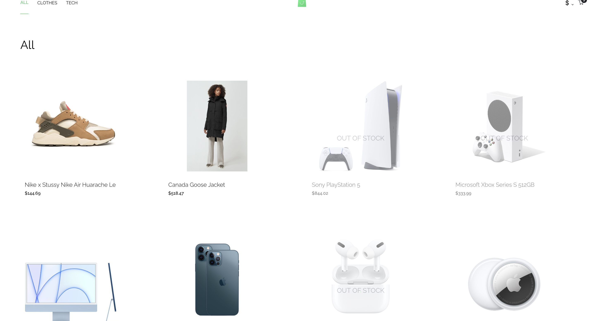
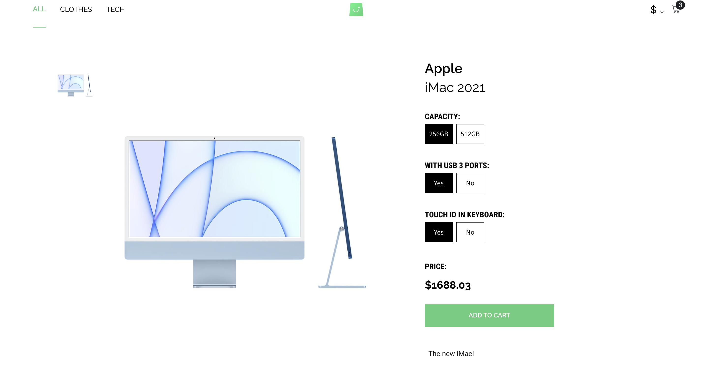
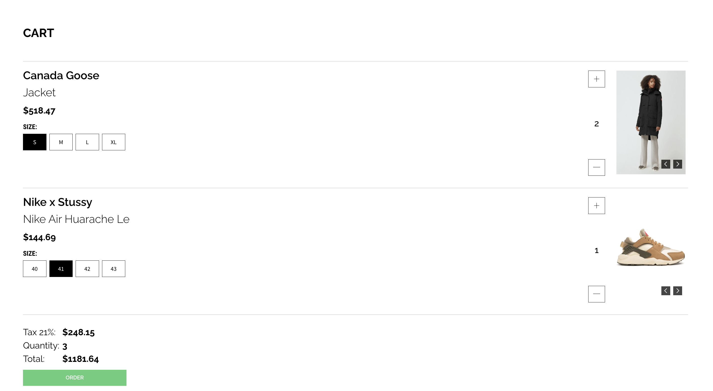
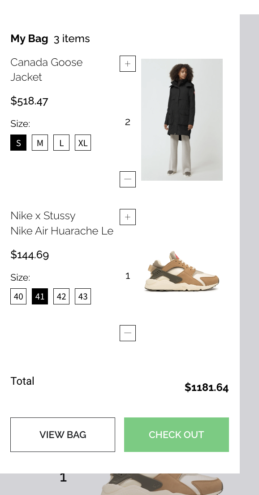

# 
 Scandiweb Shop :moneybag: <!-- omit in toc --> 

## **Contents**

- [**Contents**](#contents)
- [**Overview**](#overview)
- [**Technologies Used**](#technologies-used)
- [**Functionality requirements**](#functionality-requirements)
- [**Required**](#required)
- [**Prohibited**](#prohibited)
- [**Details**](#details)
- [**Credits**](#credits)
- [**Acknowledgments**](#acknowledgments)

## **Overview**

This project serves as an **Entry React Developer Test**. It is a React shopping app which provides the user with the ability to explore products and add them to a cart with provided currencies.

The data is fetched from the GraphQL endpoint and provides an interface to view and interact with this data.

The project is built following design and functionality principles from [this link](https://www.figma.com/file/MSyCAqVy1UgNap0pvqH6H3/Junior-Frontend-Test-Designs-Public?node-id=0%3A1).

The outcome is not pixel-perfect to the provided design, but there are no noticeable mismatches both in terms of design and functionality (in the developer's opinion :wink:).

Functionality in scale, as in a real-life project:

**Q:** What will happen if you have more than 4 products?

**A:** The grid layout used for styling splits products into columns on set parameters. Pagination might be a better use for big amount of products, but it was not required for this assignment.

[Back to contents](#contents)

## **Technologies Used**

- ### Languages

  - [JS](https://www.javascript.com/): the primary language used to develop interactive components of the website.
  - [HTML](https://developer.mozilla.org/en-US/docs/Web/HTML): the markup language used to create the website.
  - [CSS](https://developer.mozilla.org/en-US/docs/Web/css): the styling language used to style the website.
  - [GraphQl](https://graphql.org/): query language for APIs and a runtime for fulfilling those queries with existing data.

- ### Front-End Libraries

  - [ReactJS](https://reactjs.org/): was used for building a user interface
  - [React Router](https://v5.reactrouter.com/): was used for handling different URLs rendering different pages. React Router allows for rendering pages inside Virtual DOM stopping the page from refreshing. This enhances UX.
  - [styled-components](https://styled-components.com/): was used to inject CSS styling directly to component.
    - No hunt across different files to find the styling affecting your component.
    - Styled components are independent of each other.
    - Remove unused styles, even if they're declared in the code.
    - Styled components generate unique class names for your styles.

- ### Other tools

  - [Apollo](https://www.apollographql.com/): the GraphQL client used to set up API for React project.
  - [Git](https://git-scm.com/): the version control system used to manage the code.
  - [GitHub](https://github.com/): used to host the website's source code.
  - [VSCode](https://code.visualstudio.com/): the IDE used to develop the website.
  - [Grammarly](https://www.grammarly.com/): was used to check grammar and typo errors.
  - [html-react-parser](https://www.npmjs.com/package/html-react-parser): the parser converts an HTML string to one or more React elements. Was used to parse HTML elements as React elements in ProductDescriptionPage for product's description data fetched from API.
  - [eslint](https://eslint.org/): ESLint statically analyzes code to quickly find problems. Was used to check any linting errors and warning in the code.

[Back to contents](#contents)

## **Functionality requirements**

- **PLP - product listing page**, a.k.a. category page :heavy_check_mark:
  
  

- **PDP - product description page**, a.k.a. product page :heavy_check_mark:
  
  

- **Cart page** :heavy_check_mark:
  
  

- **Cart overlay** (minicart) :heavy_check_mark:
  
  

[Back to contents](#contents)

## **Required**

- React - the project is built using React.js :heavy_check_mark:
- Class components - the project is built using Class Components and no functional elements are utilised (hooks etc.) :heavy_check_mark:
- Create-react-app to scaffold the application - the project was scaffolded using the `npx create-react im-super-dev` command :heavy_check_mark:

[Back to contents](#contents)

## **Prohibited**

- UI libraries (e.g. Tailwind, Material UI, Ant Design) - no UI library was used to style this app, all styling is custom using styled-components :heavy_check_mark:
- Functional components - the project is built using Class Components and no functional elements are utilised (hooks etc.) :heavy_check_mark:

[Back to contents](#contents)

## **Details**

- **Ability to add/remove products and change their amounts in the cart - on the cart page itself, PLP and PDP should be provided**:
  - user can add products from PLP by clicking on the green cart icon (if the product is in stock) :heavy_check_mark:
  - user can add product on PDP by clicking **ADD TO CART** button (if in stock) :heavy_check_mark:
  - user can increase/decrease product amount in the cart by clicking the **+** and **-** buttons in the minicart and on the Cart Page :heavy_check_mark:
- **For products that have various options (attributes) - the options should be selected:**
  - if the product has attributes it can be selected from PDP, but it is not allowed to change attributes from minicart and Cart Page :heavy_check_mark:
  - if a user adds a product by using the "quick shop" button on the PLP or by clicking the **ADD TO CART** button on the PDP without selecting attributes, the default attribute is used as the first from the list provided by API :heavy_check_mark:
- **The selected options of adding to cart products should be visible in the cart overlay and on the cart page:**
  - selected options of adding to cart products are visible in the cart overlay and cart page for all products :heavy_check_mark:
- **If an attribute is a swatch attribute (type = swatch), a representation of the value should be rendered on PDP and PLP, rather than text description (e.g. the colour itself, not "Blue" or "0000FF"):**
  - if the attribute is of "swatch" type, then the value is used to generate the respective attribute (i.e colours are displayed as coloured boxes, not text) :heavy_check_mark:
- **Filtering products by category name for all of the categories from BE:**
  - the query created in the `queries.js` for fetching products allows to pass a pathname variable as a parameter and then be used to input required categories for products to be displayed :heavy_check_mark:
- **The descriptions provided in HTML format should be parsed and presented as HTML, not as plain text:**
  - [html-react-parser](https://www.npmjs.com/package/html-react-parser) was used to parse HTML fetched from API into JSX :heavy_check_mark:
- **Ability to change the currency of the store to one of the available currencies:**
  - users can change the currency for the shop from the currency dropdown list in the navigation bar :heavy_check_mark:

[Back to contents](#contents)

## **Credits**

1. The design is based on the [scandiweb design](https://www.figma.com/file/MSyCAqVy1UgNap0pvqH6H3/Junior-Frontend-Test-Designs-Public?node-id=0%3A1).
2. Spinning wheel for the data loading stage comes from [em-design medium](https://em-design.medium.com/figma-design-a-loading-spinner-animation-718b7e3a7f15).
3. All fonts come from [Google Fonts](https://fonts.google.com/).

[Back to contents](#contents)

## **Acknowledgments**

1. **[Scandiweb](https://scandiweb.com/) Recruitment Team** - for giving me a chance to improve my skills by doing this task - regardless of the outcome it was a great experience for self-development. Thank you!
2. As always big thanks to [Stack Overflow](https://stackoverflow.com/) community for the best bug-solving space ever created!
3. Fellow juniors for submitting and replying to comments in the Figma design provided for this task - most of the answers I found over there so big thank you guys - we are in this together :muscle:

[Back to contents](#contents)

---
**
Created by Milosz Misiek
**

    

